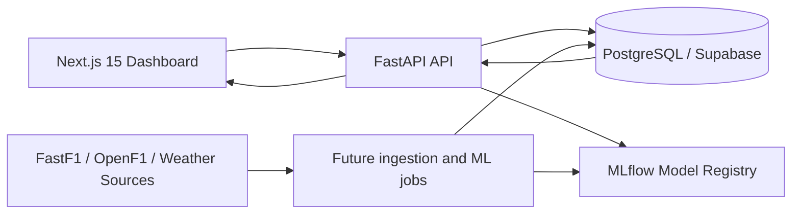

# System Architecture

## Product Boundary

The foundation supports the PRD for an F1 Strategy Intelligence Engine: interactive strategy analysis, pit-window optimization, tyre degradation intelligence, undercut and overcut prediction records, race simulations, explainability artifacts, telemetry analytics, and circuit analysis.

This scaffold intentionally does not implement ML models or business strategy logic. It defines the contracts, layers, schemas, and runtime shape needed to implement those modules safely.

## High-Level Architecture

## Application Layers

Frontend:

- Next.js app router with strict TypeScript.
- Tailwind and ShadCN-style primitives for a coherent dashboard system.
- Plotly for strategy heatmaps, gauges, distributions, and telemetry overlays.
- Domain types in `frontend/src/types` mirror backend API contracts.

Backend:

- FastAPI route layer in `backend/app/api`.
- Pydantic schemas in `backend/app/schemas`.
- Domain interfaces in `backend/app/domain`.
- Service layer in `backend/app/services`.
- Database session and infrastructure in `backend/app/db`.
- No strategy logic is implemented yet; placeholder routers define the API surface.

Database:

- PostgreSQL schema is normalized around sessions, drivers, teams, circuits, laps, telemetry, weather, stints, pit stops, predictions, and simulations.
- High-cardinality telemetry access is indexed by session, driver, lap, time, and distance.
- Prediction tables store model metadata, confidence, feature snapshots, and SHAP values as JSONB.

ML:

- Dedicated `ml/` package for future feature engineering, training, inference, explainability, and experiment tracking.
- Dependencies are declared but model code is intentionally deferred.

Infrastructure:

- Docker Compose runs PostgreSQL, FastAPI, Next.js, and MLflow.
- Supabase migrations and seed files are stored under `infra/supabase`.

## Production Concerns

- API services should own all writes to analytical tables.
- Supabase RLS enables authenticated reads and blocks client writes by default.
- Model versions must be persisted with every prediction.
- Ingestion jobs should be idempotent using external source keys where available.
- Telemetry can be partitioned by `session_id` or time later if row volume requires it.
- Every model-serving endpoint should expose confidence, explanation metadata, and input feature snapshots.

